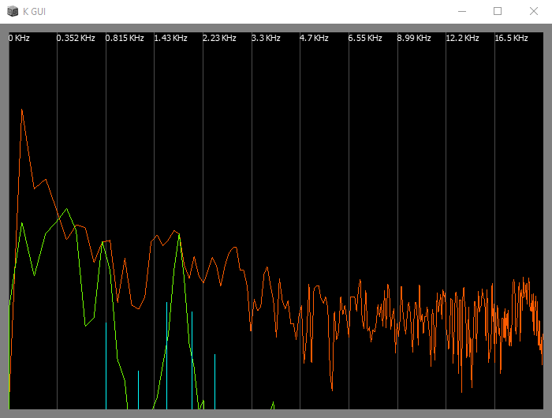

# DXARTS project 463

_For woodwind, voice and live electronics_

This is my project for DXARTS 463. Below, I will first give suggestions for the performance, then I will go into the different tools that was built for this project.

## Requirements & Set-Up

### Classes 
This project requires the UGen ArrayMax, which is not included in this repository but is available through [sc3-plugins](https://github.com/supercollider/sc3-plugins/releases).

In /Classes/, these are the classes required for this project to work. You need to [install](http://doc.sccode.org/Guides/UsingExtensions.html) these classes for the project to work.

### Set-Up
In `final.sc`, in `~tree` variable, change the frequencies `\freq` and the gains `\amp` to better match your instrument. Run the first code block to assign the `~tree`, then run the second code block to start the project with GUI.

## Score

There are two scenes in this piece, toggled using Spacebar key. The last (third) scene is empty and silent.

There are four + three controls in this piece. The GUI will aid you with the controls.

There is no explicit score for this piece but here are general instructions to follow:

First Scene (four controls):
* The first and third note should be play extended
* The second note can be played both short and long. Its loudness will determine how much noise will result from the FM modulation. You can move your instrument close to the microphone.
* The fourth note can be played in both short and long. You should play short articulations at the beginning and longer succession towards the end.
* I choose to give a ritard at the end (at the fourth note), and then slowly traverse through the third, second then first note, and finally toggle the second Scene.

Second Scene (three controls):
* The first note controls the process gain. If it's measured to be over -30dB, the frozen reverb will accept signal into its tank one second later. The length of the accepted signal corresponds to how long the note is held over -30dB. This means that the longest signal it can take without overlap is 1 second.
* The fourth note (up) and fifth note (down) controls the pitchshifter inside the reverb tank. Like the first note, the pitchshift only happens for n-seconds if it sees an n-second fourth/fifth note measured to be over -30dB.
* You can improvise with these controls however you want. I personally choose to present the non-frozen reverb first, then introduce the frozen reverb. The distinction can be made clearer if you leave space between sounds for the inputs of non-frozen reverb. 
* An effect I used to end the piece exploits the distortion happens when you pitchshift things way too much. You can feed the frozen reverb some sounds, pitchshift it down then up to cause some artifacts, these sound very much like artificial storm-like sounds (low rumbles, impulse through reverb).

Personal procedure I used for second scene:
```
flute - "Hey" - flute - "Vsauce" (frozen) - flute (frozen) - 
improvisation -
(pitchdown - pitchup) until low rumbles are sufficiently loud with impulses -
"is there a storm?" - flute - "but what is a storm?" -
pitchdown to diminish most violent impulses and rumbles
```

The reason for "vsauce" is because there are many "ess" sounds.

### Recording

I performed this on 2018/12/11 with my recorder. 

[Full (6'54'')](https://soundcloud.com/potasmic/dxarts-463-final-full)

[Submitted Excerpt (3'52'')](https://soundcloud.com/potasmic/dxarts-463-final)

## Tools

There are a few tools resulting from this project. I'm unsure if it will cooperate well with the rest of the ecosystem of SuperCollider but they work well for specific projects that don't require certain tasks. 

### KSpectro



KSpectro, the class, implements `.asView`, and therefore is compatible with `Window.layout`. It must be use in conjunction with the `\spectro` SynthDef defined in `sdefs.sc`, but you can implement your own SynthDef such that it sends an OSC message back to the client at /spectro in this format: `[nodeID, binNumber, magnitude]`; a simple way is to use SendReply UGen.

The SynthDef is implemented after Fedrick Olofsson f0 [[1]][1], although I believe there must be a better way than sending each bin's value as separate OSC messages.

```supercollider
// KSpectro takes in an array of synths to trigger (demand new FFT), fftSize, and dbRange

KSpectro([masterAnalyzer, micAnalyzer], ~fftLength, dbRange: 80);
// returns a View
```

You can have as many \spectro synths as you like, I tried two. Each analyzer should be displayed as a different color in the viewer.

#### TODOS
* I mentioned a concern above and in a comment above the \spectro SynthDef.
* I don't want to specify the synthdefs in the constructor call. However, I want to maintain that the Synths aren't sending OSC messages on their own, it should be demanded based on the framerate. Perhaps this might be possible because I do get ahold of the NodeID of the synths.

### KTree

How I organize groups, synths and buses for live performances, or projects that do not require the use of notes. 

`KTree` takes in one argument, which is a tree. This tree can has many root nodes. Each nodes are [IdentityDictionaries](http://doc.sccode.org/Classes/IdentityDictionary.html) which can have these four properties/keys:

* **type**: (required) \group or SynthDef name
* **name**: A name to refer to this node.
* **children**: An array of nodes.
* **params**: Array of parameters for Synth
* **inSibling**: Boolean. For Synths only. If true, this Synth shares the same input as the previous sibling synth in the tree.
* **outSibling**: Boolean. For Synths only. If true, this Synth writes to the same output as the previous sibling synth in the tree.

`KTree`, when instantiated, will build a Group/Node structure you've just specified on to the server as a child of Group 0.

`KTree`, when instantiated, will return an IdentityDictionary with keys `masterGroup`, `buses`, `groups`, and `synths`. The last three contain Dictionaries with all the buses, groups and synths. If a synth node is named `\example`, then `tree.buses[\example]` refers to the output bus; if it's a group node `\exampleGroup`, then `tree.buses[\exampleGroup]` refers to the output bus of the last children of the group.

Setting `\in`, `\out` in a synth's node `param` will override KTree's internal bussing structure. 

There is also a class called `KTBus`, which you can use to refer to any _named_ node's output bus that has been declared previous in the tree, if such Bus does not exist, it will create new Bus. The `~tree` in `final.sc` should give you a sense of it.

`KTree` does _not_ route to default output bus (0) for you. You need an auxilary Synth to do that. For this project, I have `\selector`, which selects different output buses of the three groups to bus 0.

_Note: I'm documenting using the term `node`, which might be confused with the class `Node`; they are not, but `IdentityDictionary`. However, since these nodes refer to the Nodes on the server, I've chose to remain using the term._

#### Caveats, TODOS

* Allow for different parent Group, rather than Group 0. `KTree(Event, Node)`
* Changing the tree after build. Allow for an instance of `KTree` to change, afterwhich you can call `.build` to re-build the tree on the Server. 
* If your Synth is terminated (e.g., calling `.release`), you will have to replace the Synth yourself. This can be tricky, especially if you don't name your nodes and need to route appropriate i/o buses.

### Dattorro Reverb

An implementation of the Dattorro reverb [[2]][2] is included in `sdefs.sc`. It has some modification such as the pitchshift in the tank.

## References

1. [Jon Dattorro][1]
2. [Fedrick Olofsson][2]

[1]: https://www.fredrikolofsson.com/f0blog/node/345
[2]: https://ccrma.stanford.edu/~dattorro/EffectDesignPart1.pdf

## License

Public Domain (where applicable)

